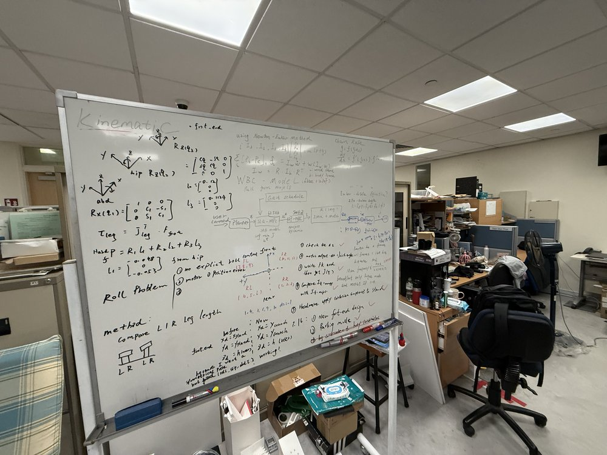
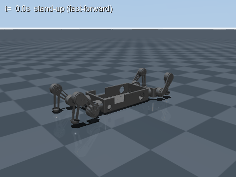

# DOG5: From MuJoCo Sim to Real Hardware and Back

DOG5 is a 12-DOF quadruped (Fusion 360 → MJCF). This repo is a progression,
not a single controller: each stage is a real step in getting the physical
robot to stand and crawl, with the simulation used first to design a
controller, then to *mirror the hardware exactly* so failures can be
diagnosed safely before the next robot session.

```
0. Model            Fusion 360 -> MJCF
1. Sim               Cartesian-compliance stand-up (full-state controller)
2. Coordinates       kinematic tree + encoder-only NumPy FK/Jacobian
3. Hardware           assemble, calibrate, position-control stand
4. Hardware           Cartesian-compliance stand  <- video below
   + Sim rehearsal     hardware-faithful 3-leg stand (de-risked in sim first)
5. Hardware           crawl attempt -> FAILED (leg dragged on weight shift)
6. Sim                diagnose the drag, fix it, simulate the full gait
```

Stages 0-2 and 4's sim rehearsal, 6 live in this branch (`main`). Stage 3 and
5's hardware controllers live on [`dog5-live-mirror`](../../tree/dog5-live-mirror);
the more complete, hardware-mirrored crawl gait lives on
[`dog5-crawl-sim`](../../tree/dog5-crawl-sim). Links to both are in
[Branches](#branches) below.

## Stage 1 — Sim: Cartesian-compliance stand-up


The first working controller, `stand_dog5.py`, stands the robot up from its
flat calibration pose using joint-space staging plus Cartesian compliance —
with full access to MuJoCo's privileged state (Jacobians, site positions,
`qfrc_bias`). It proves the *idea*; it does not yet run anything the real
robot could run.

At the calibration pose (all 12 joints = 0, legs flat fore-aft) the leg
Jacobian is rank-1: hip abduction, hip pitch and knee all move the foot
purely sideways, so a Cartesian force has **no vertical authority**. The
controller runs four phases:

| Phase | Time | Controller | What happens |
|-------|------|-----------|--------------|
| 1 ROLL  | 0–1.2 s | joint PD | each `hip_abd` rolls to ±90° so legs point outboard and the knee plane becomes vertical |
| 2 FOLD  | 1.2–2.8 s | joint PD | pitch + knee fold in the vertical leg plane to a crouch, feet under hips |
| 3 STAND | 2.8–5.3 s | Cartesian compliance | foot targets ramp from crouch (0.10 m) to standing height (0.20 m): `τ = Jᵀ(Kp·e + Kd·ė + F_ff)`, `F_ff = mg/4` per foot |
| 4 HOLD  | 5.3 s– | Cartesian compliance | fixed targets — the stand is soft; drag the trunk in the viewer and it yields and recovers |

Result: trunk settles at 0.221 m with zero steady-state droop, level
attitude, survives an 8 N × 0.3 s lateral shove.

```bash
python dog5_description/stand_dog5.py               # interactive viewer
python dog5_description/stand_dog5.py --headless     # metrics-only test
```

## Stage 2 — Coordinates: from a sim-privileged controller to hardware-faithful kinematics

Stage 1's controller reads MuJoCo's ground truth directly. The real robot
only has 12 motor encoders — no Jacobians, no site positions, no gravity
sensor. Before any hardware controller could exist, the kinematic tree had
to be understood and re-derived independently of MuJoCo:



- `view_dog5.py` opens the model with body frames, joint axes, and joint
  names visible, and prints every joint's world-frame anchor and hinge axis
  — the tool used to read off the coordinate convention above (`+x` front,
  `+y` left) and check it against the MJCF.
- `dog5_kinematics.py` is an independent, MuJoCo-free NumPy forward
  kinematics + foot Jacobian for all four legs, built from the same body/site
  geometry in `dog5.xml` — this is the module the hardware controllers run,
  copied verbatim.
- `check_dog5_kinematics.py` validates it against MuJoCo's own FK/Jacobian
  and central finite differences (tolerance 1e-10 / 1e-8) across all four
  legs — **PASS** required before anything built on top of it is trusted.
- [`SIM_TO_HARDWARE_PLAN.md`](dog5_description/SIM_TO_HARDWARE_PLAN.md) is
  the plan written at this stage: why encoders can't give absolute height,
  the encoder-calibration contract (`direction`, `zero_count`,
  `radians_per_count` per motor), and the validation ladder from offline FK
  checks up to a tethered hardware stand.

```bash
python dog5_description/view_dog5.py
python dog5_description/check_dog5_kinematics.py
```

## Stage 3 — Hardware: assembly and position-control stand

Motors calibrated against the coordinate convention from Stage 2, then a
basic position controller held the assembled robot standing — the first time
DOG5 stood on its own legs. This is native `0xA4` position-command control
(joint targets + motor-side speed caps, no torque law, encoder-only
feedback at ~20.8 Hz from a 12-motor CAN round-robin). That controller
(`stand_by_position_command.py`, `stand_dog5_hw.py`) lives on
[`dog5-live-mirror`](../../tree/dog5-live-mirror) — it is real-hardware code
and doesn't belong in the sim tree.

## Stage 4 — Hardware: Cartesian-compliance stand


The hardware result: DOG5 standing itself up under Cartesian compliance
control on the real robot, encoder-only, no dynamics model — the physical
counterpart to Stage 1's sim idea, now running the position-command/
encoder-only discipline built up in Stages 2–3.

**Sim rehearsal, done first to de-risk it:** `stand3_dog5.py` proves the next
hardware step — shift the body diagonally, unload one leg, lift it, and hold
a statically stable 3-leg stand — entirely on the hardware's own signals:



The controller side of this sim never reads MuJoCo's privileged state (no
`mj_jacSite`, `site_xpos`, `xmat`, `qvel`, true CoM); every FK/IK/Jacobian
comes from `dog5_kinematics.py`, and the only plant read is the emulated
`0xA4` position servo's own quantized encoder. Privileged MuJoCo state still
exists, but only as an *oracle* that judges the run afterward, never steers
it. Exactly how the sim is kept hardware-faithful — the servo model, the
20.8 Hz CAN round-robin, what the controller is forbidden to read — is
documented in
[`SIM_APPROACH_HW.md`](dog5_description/SIM_APPROACH_HW.md).

Result (10 s hold, hardware speed caps): swing-foot contact force 0 N,
clearance 42 mm, trunk tilt ≤ 0.43°, CoM margin ≥ 47 mm; robustness sweep
10/10 PASS over friction 0.5–1.0, mass ±10%, CoM ±10 mm, servo gains ±50%.
It also predicted a real hardware issue ahead of time: the loaded front hip
pitch peaks at 4.27 N·m, so the default 2.0 N·m torque trip **will** fire —
use ≈ 6 N·m.

```bash
python dog5_description/stand3_dog5.py --self-test   # offline IK/margin/torque checks
python dog5_description/stand3_dog5.py               # interactive viewer
python dog5_description/stand3_dog5.py --headless    # metrics + PASS/FAIL verdict
python dog5_description/stand3_dog5.py --sweep       # robustness suite
```

## Stage 5 — Hardware: crawl attempt — FAILED

The next attempt was a crawl on the real robot: shift the body's weight off
one leg, then swing that leg forward. It failed — the swing leg **dragged**
instead of lifting cleanly whenever the body shift hadn't actually finished
unloading it. The stand stayed stable; only the leg motion was wrong.

## Stage 6 — Sim: diagnose the drag, then simulate the fix

Back in MuJoCo, `hw_gap_experiments.py` reproduces the exact failure on the
hardware-faithful sim from Stage 4 and isolates the cause:

- **A — friction demand of the shift.** Feet micro-slip under the body shift
  even in sim (tangential/normal up to 0.96 at μ = 1.0) — and it doesn't
  matter, because static stability depends only on CoM-vs-feet geometry, not
  on which side does the sliding.
- **B — swing while loaded.** With the unload gate bypassed, a 30 mm
  horizontal move at zero pre-lift and μ = 2.0 (rubber) travels only 12.6 of
  30 mm and shoves the body sideways instead — **the drag failure,
  reproduced on purpose.** Pre-lift fixes it: 10 mm suffices at μ = 1.0,
  15–20 mm at μ = 2.0.
- **C — calibration error.** ±2° joint-zero error scrambles the statically
  indeterminate 4-leg load sharing badly enough (one run: 4.8 / 25.1 / 22.4 /
  5.1 N against an ideal 14.3 N each) that "wait for the shift to unload the
  leg" can never be a reliable gate on its own.

Fix: shift → pre-lift 15–20 mm → confirm clearance from encoder-FK (not from
"the shift finished") → only then swing. `walk_dog5.py` chains this into the
full hardware gait (RR → FR → RL → FL, one foot airborne at a time), still
pure position commands and encoder-FK gates, no dynamics:


Because the hardware stand pose is a sprawl with the front legs near full
reach, one **GATHER cycle** first re-anchors each foot 50 mm inboard before
the walk cycles begin. Result (2 gait cycles, hardware speed caps): body
travels 67 mm (60 commanded), every swing foot fully airborne (0 N, ≥ 13 mm
clearance), trunk tilt ≤ 2.6°, all liftoff gates ≥ 19 mm margin, no aborts —
the fix validated in sim, ready to go back to the robot.

A more complete version of this gait — mirroring the hardware crawl script
line-for-line, with a diagonal `REPOSE` cycle and in-place swing testing —
lives on [`dog5-crawl-sim`](../../tree/dog5-crawl-sim).

```bash
python dog5_description/hw_gap_experiments.py         # all 3 experiments (~10 min)
python dog5_description/hw_gap_experiments.py A       # one experiment
python dog5_description/walk_dog5.py --self-test      # whole gait IK-validated offline
python dog5_description/walk_dog5.py --headless       # metrics + PASS/FAIL verdict
python dog5_description/walk_dog5.py                  # interactive viewer
```

## Next

From the latest hardware session: review the (unpushed) foot-force-sensor
estimator and extend it to estimate body roll/pitch/yaw with streaming
visualization, then take the sim-validated crawl fix back to the real robot.

## Branches

- **`main`** (this branch) — MJCF model, hardware-independent kinematics, and
  every sim stage above.
- [`dog5-live-mirror`](../../tree/dog5-live-mirror) — the real hardware
  controllers: `stand_by_position_command.py`, `stand_dog5_hw.py`,
  `crawl_dog5_hw.py`, the CAN joint map, and the direction/calibration
  verifier. This is the code that actually runs on DOG5.
- [`dog5-crawl-sim`](../../tree/dog5-crawl-sim) — `crawl_dog5_sim.py`, a
  more complete hardware-mirrored crawl (diagonal `REPOSE`, in-place swing
  test, tucked-stance walking) than `walk_dog5.py` on `main`.

## Files

- `dog5_description/dog5.xml` — MJCF model (mesh visuals, sphere feet +
  thigh-pad collision, motor armature)
- `dog5_description/stand_dog5.py` — Stage 1 sim-only stand-up controller
- `dog5_description/view_dog5.py` — Stage 2 joint-frame inspector
- `dog5_description/dog5_kinematics.py` — Stage 2 hardware NumPy FK/Jacobian
- `dog5_description/check_dog5_kinematics.py` — validates the above against MuJoCo
- `dog5_description/SIM_TO_HARDWARE_PLAN.md` — the Stage 2 kinematics plan
- `dog5_description/stand3_dog5.py` — Stage 4 hardware-faithful 3-leg stand
- `dog5_description/SIM_APPROACH_HW.md` — how the sim is kept hardware-faithful, plus measured transfer notes
- `dog5_description/hw_gap_experiments.py` — Stage 6 diagnosis of the crawl drag
- `dog5_description/walk_dog5.py` — Stage 6 fixed kinematic crawl
- `dog5_description/make_gif.py`, `make_gif3.py`, `make_gif_walk.py` — regenerate the sim GIFs
- `dog5_description/dog5_stand_hw.gif`, `dog5_hardware.jpg` — hardware media (converted from on-device video/photo)

## Run

```bash
python -m pip install mujoco pillow numpy
python dog5_description/stand_dog5.py
```

## Modelling notes (hard-won)

- **Collision**: leg meshes are visual-only (`contype=0`); MuJoCo collides
  convex hulls, which caused phantom self-collisions during folding. Contact
  runs on foot spheres + thigh pads + trunk hull, bitmasked
  (`contype=2 conaffinity=1`) to collide with the floor only.
- **Armature**: knee joints chattered at ±25 rad/s because the 38 g shin gives
  a sampled-damping stability bound of only kd ≈ 2I/Δt ≈ 0.3 N·m·s/rad at
  500 Hz. Adding the real reflected rotor inertia
  (850 g·cm² × 10² gear ratio = 0.0085 kg·m²) fixes it; model damping is
  integrated implicitly by `implicitfast`.
